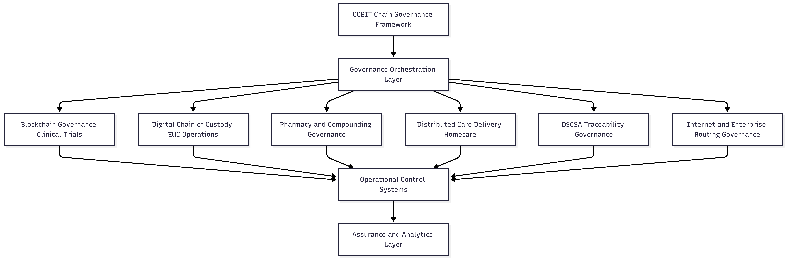

COBIT-Chain™ is a governance architecture research framework developed within the context of MBA research at the University of Wolverhampton, focused on operationalizing COBIT 2019 governance principles for regulated digital ecosystems.
# **COBIT-Chain™**  
Developed as part of MBA research in governance architecture design, COBIT-Chain™ explores how enterprise governance principles can be translated into operational control systems capable of supporting accountability, audit readiness, and digital trust across complex regulated environments.
### *A Governance Architecture Framework for Regulated Digital Ecosystems*

COBIT-Chain™ is a governance-first framework developed to operationalize enterprise governance expectations for emerging and distributed digital systems. Developed through MBA research at the University of Wolverhampton, the framework translates COBIT 2019 principles into practical, measurable governance architectures for regulated environments including pharmaceuticals, healthcare, and infrastructure operations.

Unlike technology-centric implementation models, COBIT-Chain™ focuses on governance operationalization - defining accountable roles, measurable controls, performance evidence, and continuous assurance mechanisms that enable organizations to demonstrate governance effectiveness across complex digital ecosystems.

---

## **Core Governance Model**

COBIT-Chain™ provides a structured governance artefact that links governance objectives, operational control design, accountability structures, and performance evidence into a unified control-to-evidence governance architecture aligned to COBIT domains (EDM, APO, BAI, DSS, MEA).

The model emphasizes translating governance expectations into measurable operational outcomes through structured accountability design, traceable control execution, and continuous assurance monitoring.

---

## **Research Context**

Current research develops COBIT-Chain™ as a governance artefact for blockchain adoption in regulated clinical trial ecosystems. The framework addresses a critical gap between technical feasibility and enterprise governance readiness by translating governance expectations into auditable operational control structures.

The research applies a design-science methodology combining literature synthesis, governance artefact design, and expert validation through structured interviews and thematic analysis.

---

## **Applications of COBIT-Chain™**

### **Blockchain Governance (MBA Research Focus)**  
Designing governance architecture for blockchain integration into regulated clinical trial environments, emphasizing control accountability, auditability, and assurance reporting.

### **Digital Chain-of-Custody Governance (EUC Operations)**  
Prototype governance model for asset custody workflows in regulated enterprise IT environments, focusing on traceability, accountability, and SLA governance.

### **Pharmacy and Compounding Governance Environments**  
Developing governance overlays for distributed medication workflows with emphasis on compliance, audit readiness, and operational visibility.

### **Distributed Care Delivery Governance (Homecare)**  
Applying COBIT-aligned governance models to decentralized service delivery environments requiring standardized accountability structures.

---

## Framework Architecture

  

---

## **Research Direction**

Ongoing research extends COBIT-Chain™ toward governance architectures for emerging and regulated digital environments including:

1. **Blockchain governance orchestration models** for regulated clinical trial ecosystems and distributed research networks.

2. **Digital assurance analytics frameworks** for operational governance monitoring, audit readiness validation, and continuous control evidence generation.

3. **Pharmaceutical traceability governance architectures**, including DSCSA interoperability models and governance overlays for **compound pharmacy supply chain traceability** and regulatory accountability.

4. **Blockchain-enabled Internet and enterprise routing governance architectures**, including routing control-plane governance, inter-router trust models, and routing assurance mechanisms for distributed network infrastructures.

5. **Governance readiness for post-quantum cryptographic environments**, addressing long-term digital trust, infrastructure resilience, and governance adaptation to emerging cryptographic standards.

These research directions explore how governance-first control architectures can scale across increasingly complex and decentralized digital environments while maintaining accountability, traceability, and audit readiness.
---

## Research Portfolio

The COBIT-Chain™ framework is being developed as a family of governance architectures that operationalize COBIT 2019 principles across different regulated and distributed technology environments. Each research stream focuses on translating governance expectations into auditable operational control structures.

### COBIT-Chain™ (Clinical Trials Governance)

Governance architecture for blockchain adoption in regulated clinical trial ecosystems.  
This research focuses on operationalizing governance expectations for patient consent traceability, data integrity assurance, and cross-institutional research collaboration environments.

### COBIT-Chain™ (Digital Chain-of-Custody Governance)

Governance model for enterprise IT asset lifecycle and custody assurance in regulated environments.  
The model emphasizes traceable custody transitions, SLA accountability structures, and operational audit readiness within enterprise EUC and infrastructure operations.

### COBIT-Chain™ (Pharmaceutical Traceability & DSCSA Governance)

Development of a COBIT-aligned governance overlay for pharmaceutical traceability networks under the Drug Supply Chain Security Act (DSCSA).  
The model addresses interoperability governance, cross-enterprise data trust assurance, and operational control standardization across pharmaceutical supply chain participants.

### COBIT-Chain™ (Compound Pharmacy Governance Models)

Exploration of governance architectures for distributed compounding pharmacy ecosystems where medication preparation, verification, and distribution require enhanced traceability, compliance oversight, and operational accountability structures.

### COBIT-Chain™ (Routing Governance Architecture)

Research into governance frameworks for Internet and enterprise routing infrastructures.  
This stream explores how blockchain-enabled trust anchors, routing control-plane governance mechanisms, and inter-router accountability models could improve routing integrity and infrastructure resilience.

## **About**

Taiwo Yusuf is an MBA researcher focused on governance-first operational models for regulated IT environments. His work applies COBIT 2019 principles to governance architecture design across pharmaceutical, healthcare, and infrastructure domains, with emphasis on control assurance, audit readiness, and operational traceability.
