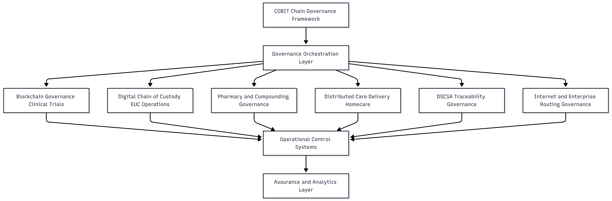

# **COBIT-Chain™**

### *A Governance Assurance Architecture for Regulated Digital Ecosystems*

**COBIT-Chain™** is a governance architecture research framework developed through MBA research at the **University of Wolverhampton**. It focuses on operationalizing **COBIT 2019** principles into auditable, measurable, and evidence-driven governance architectures for regulated digital ecosystems.

The framework is designed to help organizations answer a critical governance question:

> **Can this digital operation, control, system, or evidence chain be operationally trusted?**

COBIT-Chain™ translates enterprise governance expectations into practical control systems capable of supporting accountability, evidence integrity, audit readiness, operational traceability, and digital trust across complex regulated environments.

---

## **Research Foundation**

COBIT-Chain™ was developed as part of MBA research into governance architecture design for emerging technologies in regulated environments.

The original MBA research focused on blockchain integration in regulated clinical trial ecosystems. However, the broader contribution of COBIT-Chain™ extends beyond blockchain. The framework positions blockchain as one possible enabling technology within a larger governance assurance architecture.

The core research contribution is the development of a **control-to-evidence assurance model** that connects:

* Governance objectives
* Operational controls
* Accountability structures
* Evidence artefacts
* Audit readiness
* Integrity verification
* Continuous assurance monitoring

This allows governance to move from policy-level intention into operationally measurable proof.

---

## **Core Governance Model**

COBIT-Chain™ provides a structured governance artefact that links governance objectives, operational control design, accountability structures, and performance evidence into a unified **control-to-evidence governance architecture** aligned to COBIT 2019 domains:

* **EDM** – Evaluate, Direct and Monitor
* **APO** – Align, Plan and Organize
* **BAI** – Build, Acquire and Implement
* **DSS** – Deliver, Service and Support
* **MEA** – Monitor, Evaluate and Assess

The model emphasizes translating governance expectations into measurable operational outcomes through:

* Defined ownership
* Traceable control execution
* Evidence integrity assurance
* Exception visibility
* Governance dashboards
* Audit-ready evidence packs
* Portable governance assurance passports

---

## **Framework Architecture**

The conceptual architecture of COBIT-Chain™ illustrates how governance orchestration layers translate into operational control systems and assurance analytics capabilities.

  

---

## **Research Context**

The current research develops COBIT-Chain™ as a governance artefact for blockchain adoption in regulated clinical trial ecosystems.

The framework addresses a critical gap between technical feasibility and enterprise governance readiness by translating governance expectations into auditable operational control structures.

The research applies a design-science methodology combining:

* Literature synthesis
* Governance artefact design
* COBIT 2019 alignment
* Prototype demonstration
* Evidence integrity modelling
* Professional practice observation

COBIT-Chain™ is therefore positioned as a **governance-first operationalization model**, not merely a technology implementation framework.

---

## **Applications of COBIT-Chain™**

### **Blockchain Governance**

Designing governance architecture for blockchain integration into regulated clinical trial environments, emphasizing control accountability, evidence integrity, auditability, and assurance reporting.

### **Continuous Audit Evidence Integrity**

Providing a control-to-evidence assurance model that verifies whether audit artefacts remain complete, traceable, and defensible after they are created, stored, exported, reviewed, or reused.

### **Pharmaceutical Manufacturing Governance**

Supporting governance assurance for GMP systems, manufacturing IT systems, operational readiness, digital quality systems, and inspection readiness.

### **ServiceNow CMDB Governance**

Extending governance assurance into Configuration Item ownership, support group assignment, lifecycle management, MyAccess readiness, evidence lineage, and operational trust through the CITrust™ model.

### **Digital Chain-of-Custody Governance**

Prototype governance model for asset custody workflows in regulated enterprise IT environments, focusing on traceability, accountability, SLA governance, and audit readiness.

### **Pharmacy and Compounding Governance**

Developing governance overlays for distributed medication workflows, with emphasis on compliance, traceability, operational visibility, and evidence-based accountability.

### **Distributed Care Delivery Governance**

Applying COBIT-aligned governance models to decentralized service delivery environments requiring standardized accountability, evidence integrity, and operational oversight.

---

## **Research Portfolio**

The COBIT-Chain™ framework is being developed as a family of governance assurance architectures that operationalize COBIT 2019 principles across regulated and distributed technology environments.

### **COBIT-Chain™: Clinical Trials Governance**

Governance architecture for blockchain adoption in regulated clinical trial ecosystems.

This research focuses on operationalizing governance expectations for protocol evidence, patient consent traceability, data integrity assurance, audit readiness, and cross-institutional research collaboration environments.

### **COBIT-Chain™: Continuous Audit Evidence Integrity**

A control-to-evidence assurance model focused on verifying the integrity, completeness, and defensibility of audit artefacts used to prove that governance controls have operated effectively.

### **CITrust™: ServiceNow CMDB Governance Assurance**

A governance assurance model focused on Configuration Item trustworthiness in ServiceNow environments.

CITrust™ addresses CI ownership, support groups, lifecycle management, CMDB reconciliation, MyAccess routing, evidence lineage, operational readiness, and pre-deviation governance.

### **AssuranceLayer™: Governance Assurance Platform**

A proposed digital assurance platform for visualizing governance health, evidence integrity, inspection readiness, operational trust, and continuous compliance posture across regulated environments.

### **Governance Assurance Engineering**

An emerging research direction focused on measuring operational trust, evidence integrity, and inspection readiness in regulated digital systems.

This research stream explores how governance can become measurable, auditable, and continuously assured across complex digital operations.

### **COBIT-Chain™: Pharmaceutical Traceability and DSCSA Governance**

Development of a COBIT-aligned governance overlay for pharmaceutical traceability networks under the Drug Supply Chain Security Act.

The model addresses interoperability governance, cross-enterprise data trust, supply chain evidence, and operational control standardization across pharmaceutical supply chain participants.

### **COBIT-Chain™: Compound Pharmacy Governance Models**

Exploration of governance architectures for distributed compounding pharmacy ecosystems where medication preparation, verification, and distribution require enhanced traceability, compliance oversight, and operational accountability.

### **COBIT-Chain™: Routing Governance Architecture**

Research into governance frameworks for Internet and enterprise routing infrastructures.

This stream explores how governance-first trust anchors, routing control-plane governance, inter-router accountability, and assurance mechanisms could improve routing integrity and infrastructure resilience.

---

## **Current Research Direction**

Ongoing research extends COBIT-Chain™ into a broader research program known as **Governance Assurance Engineering**.

This work explores how governance-first control architectures can scale across increasingly complex and decentralized digital environments while maintaining:

* Accountability
* Traceability
* Evidence integrity
* Audit readiness
* Operational trust
* Regulatory defensibility
* Inspection readiness

The long-term research direction includes AI-enabled pharmaceutical manufacturing, radiopharmaceutical operations, ServiceNow governance, digital quality systems, and intelligent manufacturing assurance.

---

## **Working Papers**

1. **Operationalizing COBIT 2019 for Continuous Audit Evidence Integrity in Regulated Clinical Trial Environments: The COBIT-Chain™ Framework**

2. **Governance Assurance Engineering: Towards Continuous Operational Trust in Regulated Pharmaceutical Manufacturing**

3. **CITrust™: A Governance Assurance Model for ServiceNow CMDB Readiness in GMP Environments**

4. **Engineering Operational Trust: An AI-Enabled Governance Assurance Framework for Intelligent Pharmaceutical Manufacturing**

---

## **About**

**Taiwo M. Yusuf** is a governance assurance researcher and pharmaceutical IT professional focused on governance-first operational models for regulated digital environments.

His work applies COBIT 2019 principles to governance architecture design across pharmaceutical, healthcare, clinical research, infrastructure, and intelligent manufacturing domains.

His research interests include:

* AI Governance
* IT Governance
* COBIT 2019
* Pharmaceutical Manufacturing
* Digital Assurance
* Evidence Integrity
* ServiceNow CMDB Governance
* Regulatory Science
* Operational Trust
* Inspection Readiness

---

---

## Publications

### Peer-Reviewed Publications

*No peer-reviewed publications at this time.*

---
## Working Papers

1. **Operationalizing COBIT 2019 for Continuous Audit Evidence Integrity in Regulated Clinical Trial Environments: The COBIT-Chain™ Framework**  
   *Manuscript in preparation.*

2. **Governance Assurance Engineering: Towards Continuous Operational Trust in Regulated Pharmaceutical Manufacturing**  
   *Concept paper in development.*

3. **CITrust™: A Governance Assurance Model for ServiceNow CMDB Readiness in GMP Environments**  
   *Research framework under development.*

4. **Engineering Operational Trust: An AI-Enabled Governance Assurance Framework for Intelligent Pharmaceutical Manufacturing**  
   *Proposed PhD research direction.*

---

## **Contact**

* **Google Scholar:** 
* **ORCID:** Coming soon
* **LinkedIn:** https://www.linkedin.com/in/taiwo-m-yusuf-75197520/
* **GitHub:** https://github.com/taiwoyusuf

---

## Research Timeline

**2026**  
MBA dissertation submitted: *COBIT-Chain™: A COBIT 2019-Aligned Governance Framework for Blockchain Integration in Regulated Clinical Trial Environments.*

**2026**  
Google Scholar profile created.

**2026**  
First journal manuscript in preparation: *Operationalizing COBIT 2019 for Continuous Audit Evidence Integrity in Regulated Clinical Trial Environments.*

**2026–2027**  
PhD research development focused on Governance Assurance Engineering, AI Governance, Pharmaceutical Manufacturing, and Evidence Integrity.

---

## Research Vision

The long-term vision of COBIT-Chain™ is to establish **Governance Assurance Engineering** as an interdisciplinary research field combining enterprise governance, artificial intelligence, evidence integrity, operational trust, pharmaceutical manufacturing, and regulatory science.

This research aims to help regulated organizations move beyond policy-level compliance toward continuously assured digital ecosystems where controls, evidence, accountability, and operational trust can be measured and demonstrated.

---
